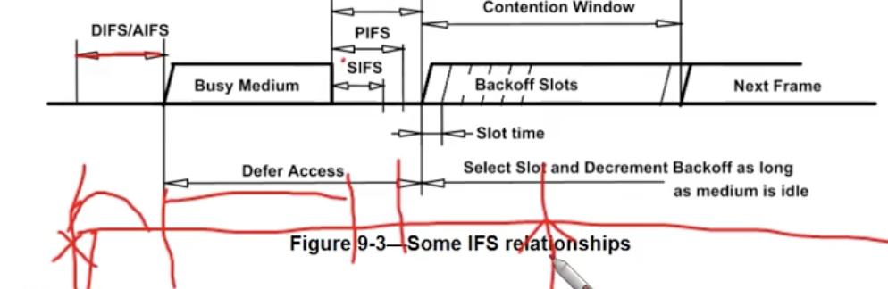
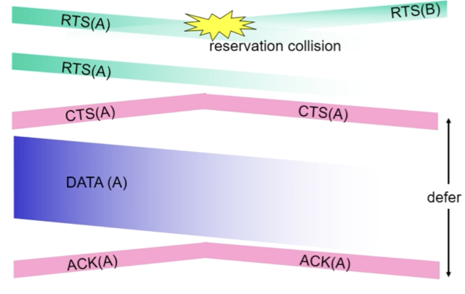

CSMA/CA : 무선랜에서 사용하는 통신방법으로 충돌을 피하기 위한 방법

Ifs -> frame trans -> 패킷을 받았으면  수신 측 잠시 대기(sifs) -> ack전송
Csma : 채널이 사용중이지 않을 때는 전송하고 사용중이면 기다린다(연기한다).
다중 엑세스 네트워크에서 노드 간의 충돌을 최소화하여 데이터를 전송하기 위한 프로토콜이다. 

구체적으로 RTS/CTS 방식을 사용하는데, 데이터를 보내기전에 Request To Send 신호를 보내고 수신지에서 Clear To Send 신호를 보내면 데이터를 전송하게 된다. 데이터를 받으면 수신지는 ACK를 보낸다.