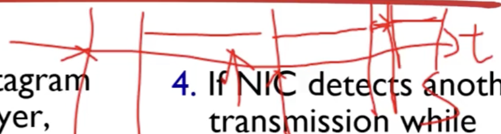

CSMA/CD : 유선랜(이더넷)에서 충돌을 피하기 위한 방법

Carrier sensing 구간 -> frame 전송 -> backoff 구간 -> csma구간 ->  frame 전송 -> success
Csma/cd에서 충돌이 감지되면 신호를 폐기하고 잼 시그널을 보낸다. 그 이후 binary backoff(0~2^n-1 중에 랜덤으로)를 통해 충돌 횟수에 따라서 단위 전송길이의 얼마만큼 기다릴지 결정하고 다시 재전송을 시도한다.
재밍 시그널이 없는 것이 전송 성공