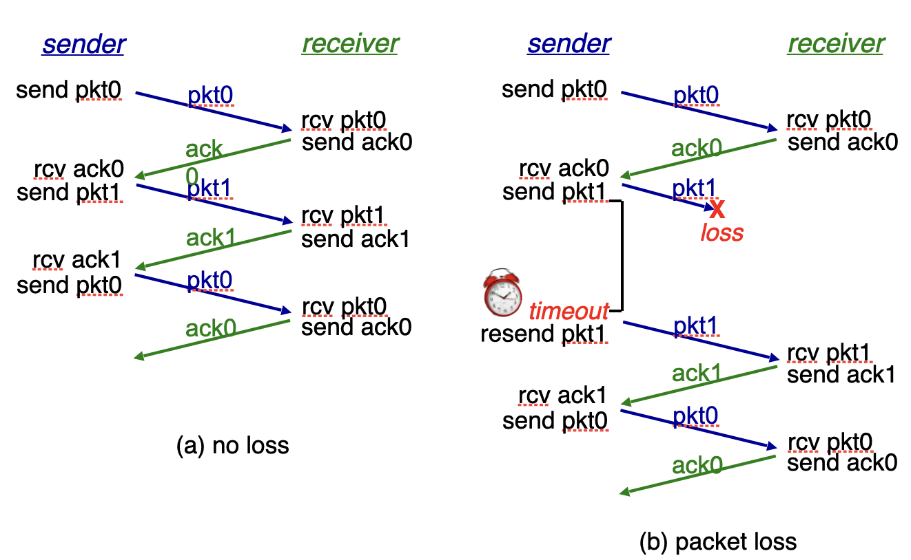
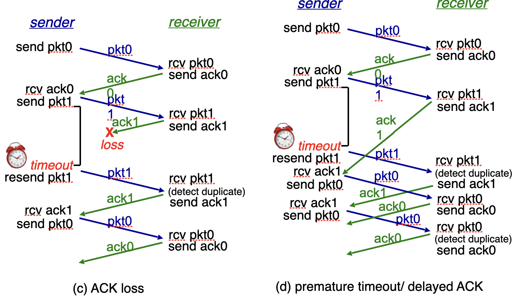
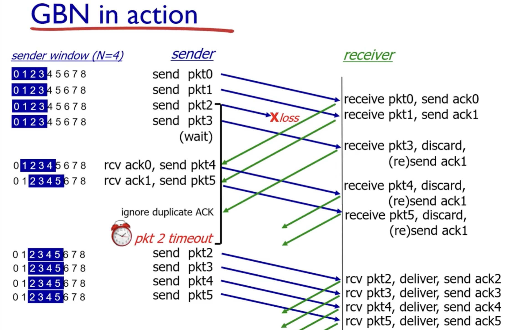
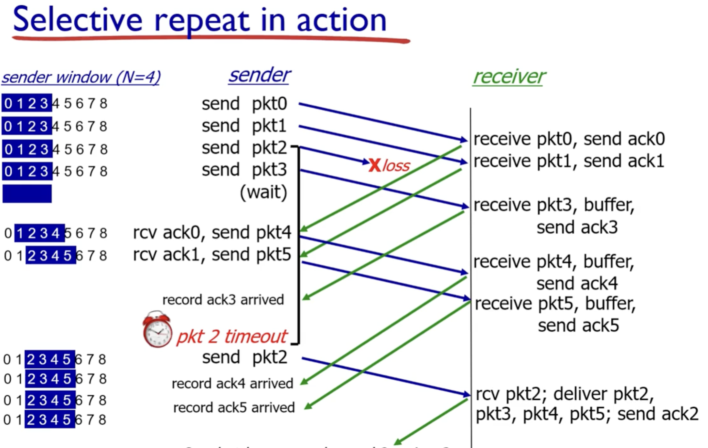
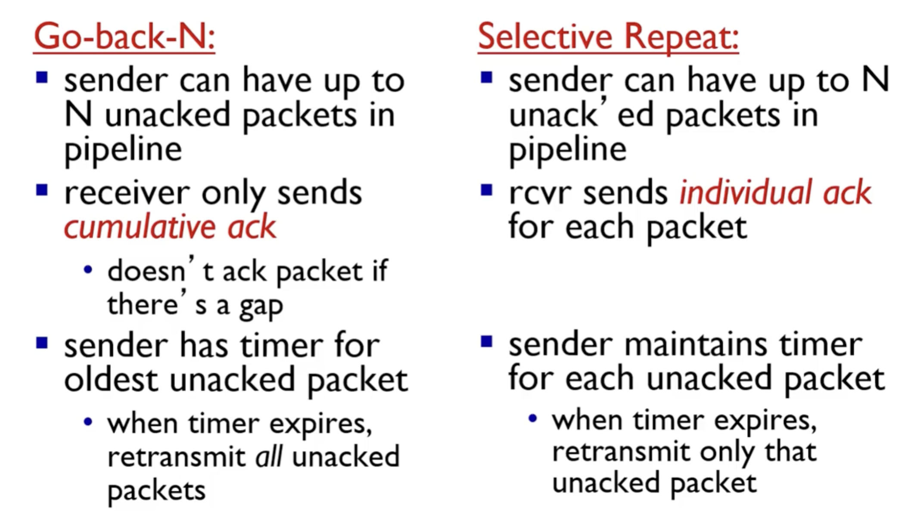
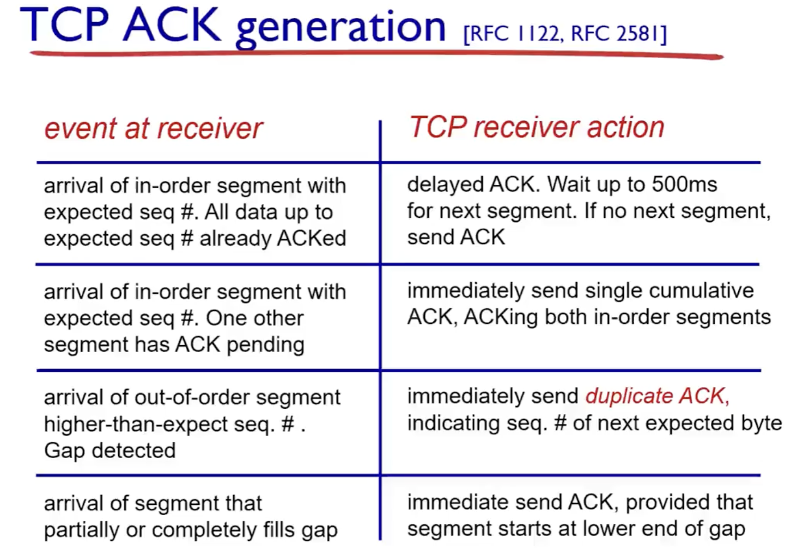
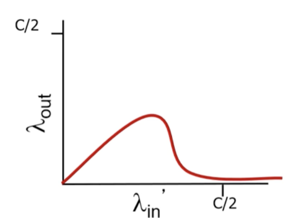

애플리케이션에서 데이터를 보내려고하면

    1. 데이터를 전송크기에 알맞는 크기로 쪼개고, 쪼갠 데이터에 목적지 프로그램을 식별할 정보를 덧붙인다.(트랜스포트 계층)
    
    2. 수신지를 식별할 데이터를 붙인다.(인터넷 계층)

    3. 하드웨어에 신호 전달에 필요한 정보를 붙인다. 이렇게 덧붙여진 정보들을 헤더라고 한다.(네트워크 인터페이스 계층)

    4. 하드웨어에서 전기나 광 신호로 변환되어 전송

    5. 각 계층별로 자신의 계층에 해당하는 헤더를 통해 식별하여 다음 계층으로 전달한다.

    6. 트랜스포트 계층에서 데이터가 모두 수신되었다면 데이터들을 순서에 맞춰 결합하고 애플리케이션 계층으로 전달한다. 제대로 전달되지 않았다면 재전송을 송신지 트랜스포트 계층에 요청한다.

    7. 데이터를 전달받아 서비스 제공

중간에 패킷 손실되면 타임아웃을 통해 알아내고 재전송. 재전송시에도 타이머.
중간에 ack 손실이 일어나도 타임아웃이 발생해 재전송.
리시버는 받으면 무조건 바로 ack전송.

Gbn : 차례로 패킷을 보내고 ack를 받는데 이 때, 수신을 하지 못하면 다음 패킷부터는 죄다 폐기함. 송신 측에서는
손실된 패킷에 대한 ack가 time out되어서 다시 손실된 패킷부터 다시 보냄

Sr : 차례로 패킷을 보내고 ack를 받는데, 패킷이 손실되면, 수신측에서는 다음에 받는 패킷들을 버퍼에 저장하고
ack를 보낸다. 송신측에서는 ack를 받은 사실을 기록하고 손실된 패킷에 대한 ack의 time out이 발생하면
손실된 패킷만을 재전송한다.

두 프로토콜 모두 패킷을 보내고 ack를 받거나 time out을 측정하지만
gbn은 수신측에서 그 다음 패킷들은 폐기하고 다시 해당 패킷부터 순차적으로 다시 보내지만
sr은 수신측에서는 그다음 패킷들을 버퍼에 저장하고 송신측에선 ack를 기록해두어 해당 패킷만을 보내고
성공적으로 수신되면 버퍼에 저장된 패킷들과 함께 처리한다는 것이다.

tcp는 모든 세그먼트를 받고 그 전 세그먼트들도 문제없이 ack를 받았다면, 다음 세그먼트가 없는지 기다린뒤 ack를 보낸다. 만약 아직 ack를 받지 못한 세그먼트가 있다면 현재 받은 세그먼트를 포함한 누적 ack를 받는다. 세그먼트 갭이 발생하면, 중복 ack를 보낸다. 손실된 세그먼트를 받게 되면, 즉시 다음 갭을 나타내는 ack를 보낸다. 누적 ack와 중복 ack를 보낸다는 점에서 gbn을, 순서가 맞지 않는 세그먼트틀 버리지 않고 갖고 있고 손실이 발생한 세그먼트만 다시 보낸다는 점에서 sr과 같다. 성공적인 수신 뒤에 delayed ack를 사용한다는 점에서 gbn, sr과 차이점이 있다.

일정 수준까지 증가하다가 급격하게 goodput량이 줄어들게 되는데 이는 재전송 패킷을 받게 된다는 것이다.
그렇기 때문에 일정 수준까지만 input을 허용해야 낭비없이 congestion control이 가능하다.
여기서 input 버퍼가 가득차면 윈도우 사이즈를 0으로 줄이고 전송을 잠시 멈춘다.

이런 식의 혼잡 제어를 TCP Reno와 Tahoe라는 방식으로 조절하게 된다.