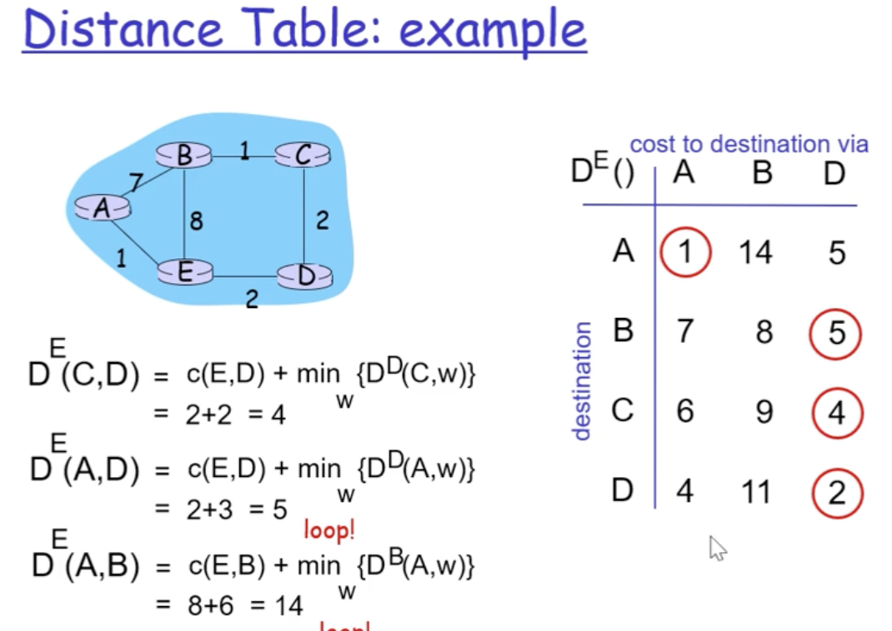
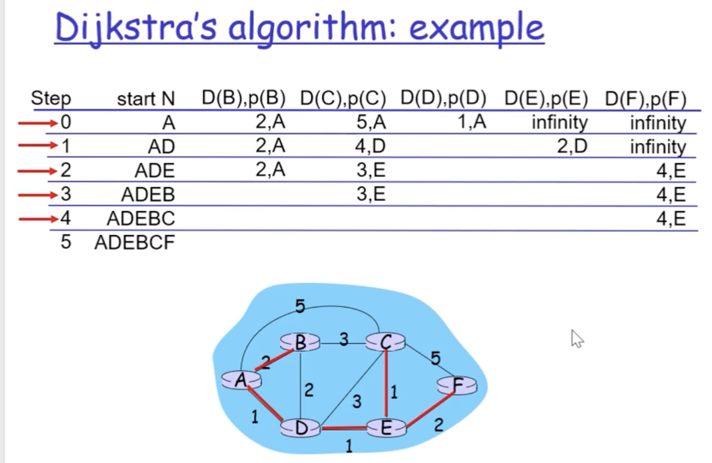
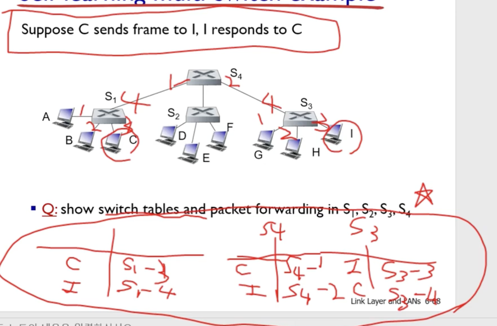

인터넷 계층에서는 데이터 전달을 위해 라우터를 사용한다.

라우터는 네트워크와 네트워크를 연결한다. 데이터 전달을 위해 다음 네트워크의 경로를 찾고 데이터 전달을 위임한다. 해당 과정이 연쇄적으로 반복되는데 이런 방식으로 경로를 찾아나가는 과정을 라우팅이라고 한다. 라우터 내부에는 라우팅 테이블을 만들어서 인접한 라우터들의 정보를 저장하여 보다 빠른 전송을 가능하게 한다.

패킷이 목적지를 찾지못하면 소멸시키도록 하는 생존시간(Time To Live)가 존재한다.

IP 주소 내에는 주소 클래스를 두어 네트워크부와 호스트 부를 길이별로 구별하였다. 

그러나 주소 클래스는 내부가 고정되어 있어서 주소를 할당할 수 있는 기계의 수가 한정될 수 밖에 없는데 이를 해결하기 위해서 서브넷 마스크를 사용하면 유연하게 늘려 쓰는 것이 가능하다. 호스트 부에 있는 비트를 사용하여 전체 네트워크의 규모를 늘리지만 개별 네트워크 내의 호스트 수를 줄임으로써 다양한 네트워크를 구성할 수 있게 된다. 24비트 서브넷 마스크를 할 경우 앞의 24비트를 1로 설정하여 AND연산을 통해 네트워크 부분과 호스트 부분을 분리할 수 있다.

라우팅 프로토콜은 경로 유무, 경로 결정, 경로 선택의 3가지 목표를 가지고 있음

라우팅 프로토콜 알고리즘 : distance vector와 link state 두 가지 알고리즘이 있음

    Distance vector algorithm : bellman-ford 알고리즘 사용, 각 근처 라우터들끼리 테이블을 교환하는 방식으로 테이블 채워나감.
    교환으로 인해 convergence가 오래걸림. 무선에서 사용 시 효과적

    Link state : Dijkstra algorithm을 사용, 시작점에서부터 모든 경로에 메세지를 보내서 모든 경로를 계산함. 부모 노드를 기준으로 모든 경로를 계산하므로 전처리는 오래 걸리지만, 유선통신시에 토폴로지가 변경되거나 커지면 상대적으로 빠른 속도 유지가능
    -> 라우터의 forwarding 속도를 증가시킬 수 있는 알고리즘을 개발하게 된다면 조금만 증가시켜도 큰 성능 향상을 기대할 수 있고, 
    destination에 label을 붙여 per-connection management를 하게되면 성능 향상을 기대할 수 있다.

    요청을 받으면 스위치가 해당 요청에서 온 단말의 정보를 기록, 처음에는 테이블이 비워져있으므로 모든 스위치 및 단말에 브로드캐스팅하여 알맞는 경로로 전송함.
