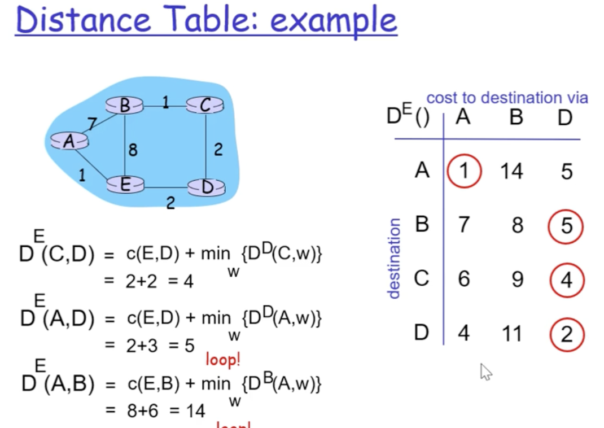
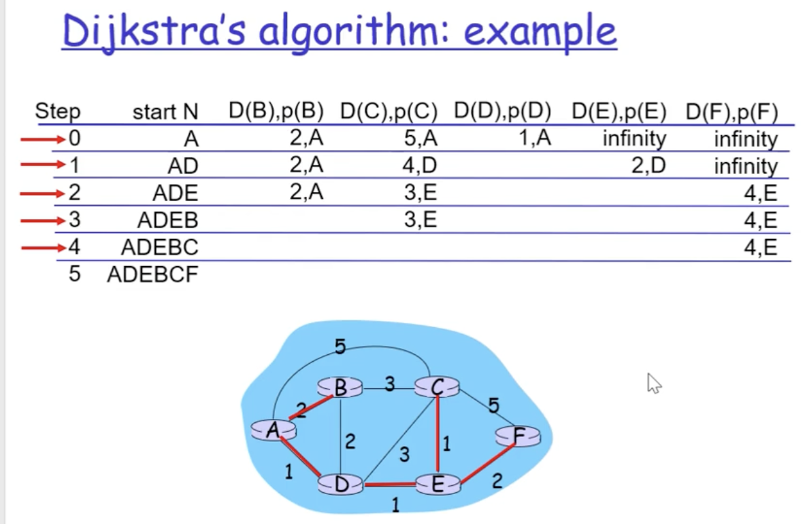

라우팅 프로토콜은 경로 유무, 경로 결정, 경로 선택의 3가지 목표를 가지고 있음

라우팅 프로토콜 알고리즘 : distance vector와 link state 두 가지 알고리즘이 있음

    Distance vector algorithm : bellman-ford 알고리즘 사용, 각 근처 라우터들끼리 테이블을 교환하는 방식으로 테이블 채워나감.
    교환으로 인해 convergence가 오래걸림. 무선에서 사용 시 효과적

    Link state : Dijkstra algorithm을 사용, 시작점에서부터 모든 경로에 메세지를 보내서 모든 경로를 계산함. 부모 노드를 기준으로 모든 경로를 계산하므로 전처리는 오래 걸리지만, 유선통신시에 토폴로지가 변경되거나 커지면 상대적으로 빠른 속도 유지가능
    -> 라우터의 forwarding 속도를 증가시킬 수 있는 알고리즘을 개발하게 된다면 조금만 증가시켜도 큰 성능 향상을 기대할 수 있고, 
    destination에 label을 붙여 per-connection management를 하게되면 성능 향상을 기대할 수 있다.

    요청을 받으면 스위치가 해당 요청에서 온 단말의 정보를 기록, 처음에는 테이블이 비워져있으므로 모든 스위치 및 단말에 브로드캐스팅하여 알맞는 경로로 전송함.
