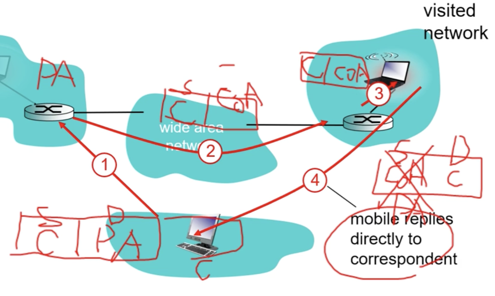

무선 통신 : 

Hidden terminal problem : 서로 다른 송신측을 볼 수 없는 문제. 이로 인해 충돌 발생 시 문제 해결 불가능
Exposed terminal problem : 다른 송신의 영향으로 인해 터미널이 busy한 상태라고 착각하여 통신이 지연되는 문제

히든 터미널이 더 심각함. 결과적으로 충돌이 발생했으므로.

충돌을 피하기 위해 CSMA/CA를 사용함

    Seamless Communtication을 위해서(모바일 기기가 handoff시에 direct routing은 연결이 끊긴다)

