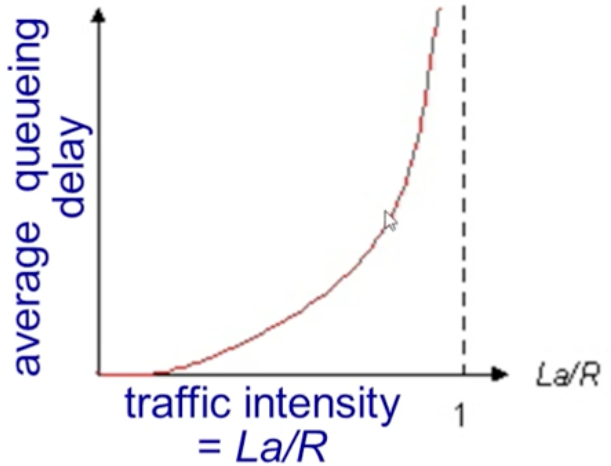

Delay = Processing delay + Queueing Delay + Transmission Delay + Propagation Delay
이 중 Transmission Delay와 Propagation Delay는 하드웨어적인 성질이므로 
라우터 내의 Processing Delay와 Queueing Delay를 줄임으로써 전체 delay를 조절하도록한다.

Traffic Intencity : La/R (R : link bandwidth, L: packet length, a : average packet arrival rate)
L과 R은 하드웨어적인 성질이므로 a를 통해 delay를 bound하여야함