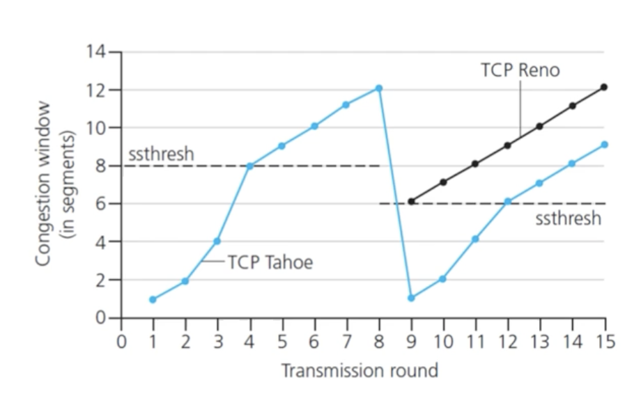

오류가 발생하거나 버퍼가 가득차서 윈도우 사이즈가 0이 되는 경우에 TCP Reno와 TCP Tahoe라는 방식을 통해서 혼잡 제어를 할 수 있다.

처음에는 slow start를 통해 1개에서 시작하여 2배씩 늘려나가다가 ssthresh 값에 도달하면 additive increase로 바꿔 1씩 증가하는 방식으로 하고, 오류 발생 시 taeho는 1개로 줄여 기존 slow start로 다시 시작하여 ssthresh 값을 오류 발생시점의 절반에 해당하는 값으로 설정한다. reno는 기존 값의 절반으로 줄이고 additive increase를 사용하는 방식이다. 